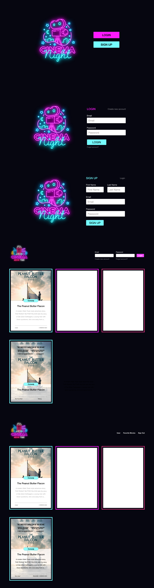
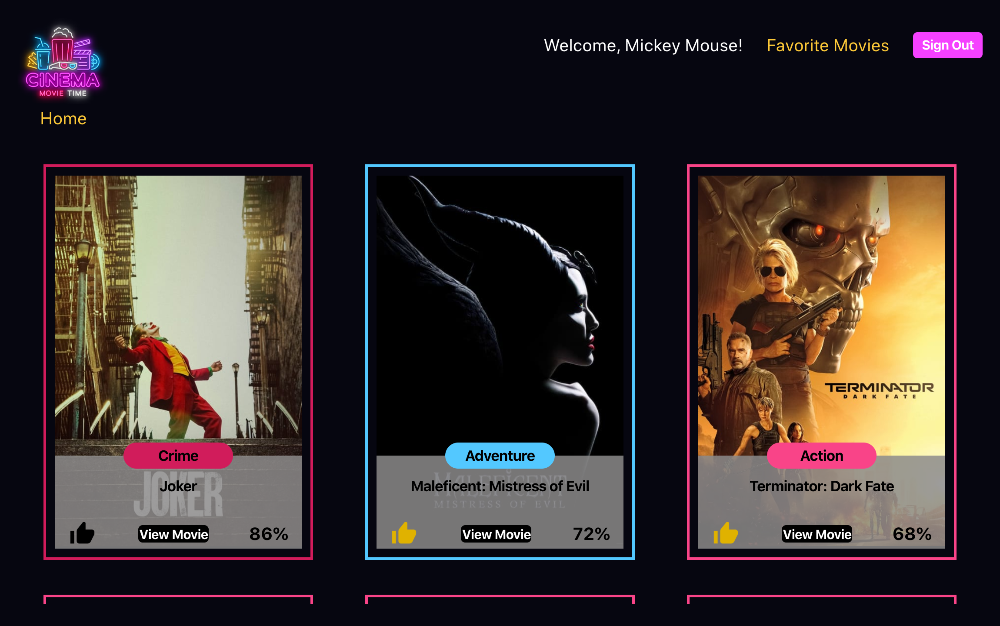
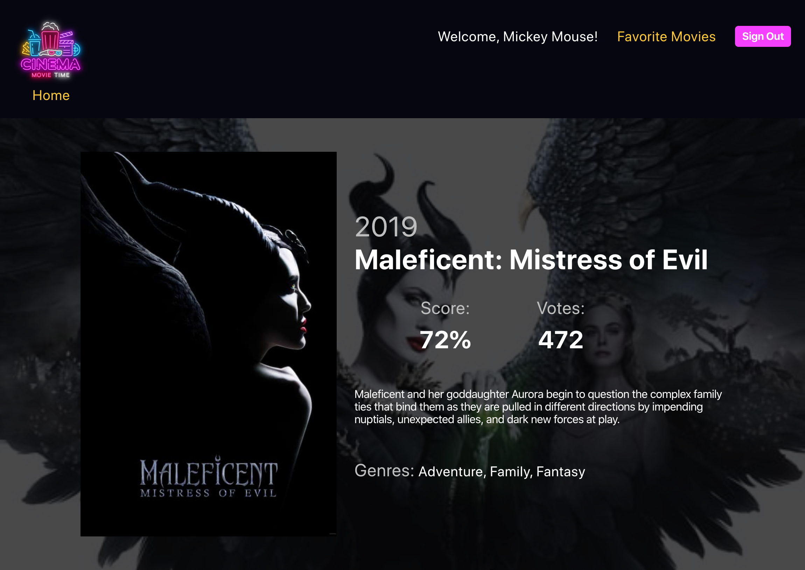
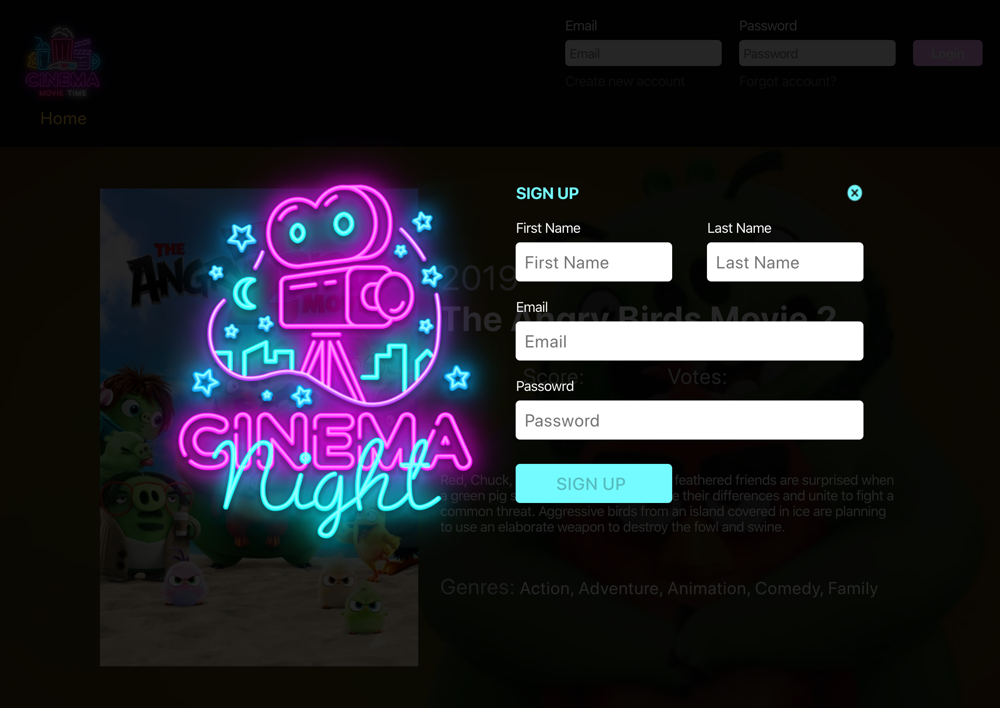

# Movie Tracker
By:
[Matthew Malone](https://github.com/matthewdshepherd)
[Chris Basham](https://github.com/chrisdbasham317)

## Table of Contents
* [Built With](#Built-With) 
* [Screenshots](#Screenshots)
* [Features](#Features)
* [Try It Out](#Try-It-Out)
* [Take It For A Spin](#Take-It-For-A-Spin)
* [Why'd-We-Do-This?](Why'd-We-Do-This?)
* [Link to Project Management Board](Link-to-Project-Management-Board)

## Built With

- HTML5
- CSS3
- JavaScript
- React
- Router
- Redux
- TDD (Jest, Enzyme)
- OOP
- Fetch API - themoviedb.org

## Screenshots

Movie Tracker allows us to design and create the UI/UX.
#### The Wireframe:

Here are screen shots and a gif of a short walkthrough of the app:

## Features

- [x] Built on React
- [x] React Modals
- [x] React Router
- [x] Fetch
- [x] Nested Fetch
- [x] Loading Screens while fetch is in progress
- [x] Paths making use of forward/back button
- [X] Dynamic path setting 
- [x] Favorited characters persist across web app and correctly appear when view other episodes
- [x] Signing out redirects back to main page, clearing out all data and resetting state for new user

## Try It Out

- [x] Browse the latest movies!
- [X] Click view more on a movie you're iterested in to get more details
- [X] Login to view your stored favorites!
- [X] Don't have an account? No problem, click on the create account to get get started creating your own.
- [X] Favorite some movies and come back later to check them out.
- [x] Upon account creation, your name will appear at the top of the page.
- [X] Valid email address and password more than 6 characters will enable login and/or signup button.
- [X] Only one account per email address, if attemtped again a warnig will pop up letting you know.
- [X] If password and/or email address do not match a warning will pop up letting you know. 
- [x] Favorite Movies page shows all of the movies you've favorited while browsing.

## Take It For A Spin

This site requres a few steps to get full functionality.
To view the site and get more info about movies follow this site:

View <a href=https://vrandall66.github.io/SWAPI-Trivia/>here</a> on GitHub.

## Why'd We Do This?

We are students at Turing School of Software and Design, whom provioded the project specifications and website design. We are learning all the things on our way to becoming Software Engineers.

## Link to Project Management Board
[Link to Project Management Board](https://trello.com/b/SbtYTXpO/movie-time-board)
